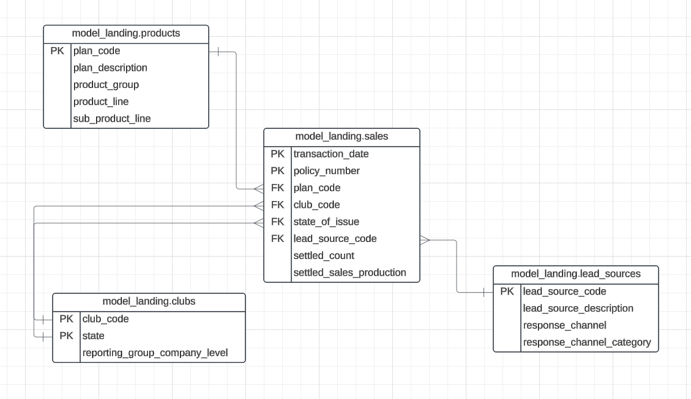

## AAA Life Insurance Analytics Engineer Assessment
### CONTACT: JBickmeyer@aaalife.com

### SETUP:

- Make sure you have Docker installed on your local machine. Installation instructions for your OS
  can be found at https://www.docker.com/.
- UNZIP the assessment project onto your machine, and access this new project directory using the
  text editor of you choice
- Go to terminal, and make sure you are in the project's root directory
- Run the command `docker compose up -d --build`
- Now exec into the dbt container with the command `docker exec -it analytics_engineer_assessment-dbt-1 /bin/bash`
- Here you should be able to run `dbt debug` successfully. If you can't then contact us for help.
- Run the command `dbt seed` to load the 4 starting tables into the database. They will be loaded
  into the model_landing schema.

This setup will create 2 docker containers, one of them is a containerized image of the dbt project
and the other is a postgres database that we are using as our data warehouse. The connection and
credentials for the postgres database are below. You should be able to query the database from any
SQL IDE that works with postgres. A free one can be downloaded at https://dbeaver.io/.

- **Database Name:** dbt_db
- **Username:** dbt_user
- **Password:** dbt_password
- **Host:** localhost
- **Port:** 5432

## Assessment Questions

1. Oh no! It looks like our `lead_sources` landing table has some duplicate records. Please build a 
   dbt model called `lead_sources` in the `staging` schema that de-duplicates this important dimension
   table for us. This table should be unique at the `lead_source_code` grain. Please add a test to this
   model that will alert us if this grain is ever broken.

2. Sales leadership wants to know how our sales (`settled_count` and `settled_sales_production`) 
   have been trending by week. Build a dbt model called
   `company_sales` in the `gold` schema that summarizes the sales production
   by **week** for each `reporting_group_company_level`. Also be sure to include these additional dimensions
   that management likes to filter their reports by: `product_group`, `product_line`, `sub_product_line`,
   `response_channel`, and `response_channel_category`.
3. Marketing wants to know which products they should be marketing in each region. 
   Design a model that identifies the most popular product lines (`product_line`) by region(`state_of_issue`). 
   Include the number of
   policies sold (`settled_count`) and the total sales amount (`settled_sales_production`) for each 
   product line. Also create a custom column called `product_popularity_rank` that ranks how popular
   each product line is within each region. A rank of 1 would indicate that product line is the most
   popular within that region. There shouldn't be any tied rankings within a region.